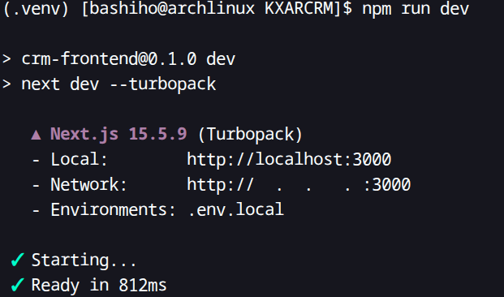

# fetchData

## What is it? 
This is a method utulized throughout the project to fetch data from the supabase database. It is an async lamda functions and also includes error handling. 

## Signature/Endpoint
const fetchData = async () => { ... };

## Parameters
The method declaration itself does not take in any parameters, but inside the method it receives table data from the supabase depending in what page file it is written. 

## Return values
The method does not return anything, but it does assign the returned table value from the supabase to the customers variable using react state hooks and by calling the setCustomers() or
setProjects() or setPatments() method

## Errors or Exceptions
Within the method if there is any errors during the reteival process of the data fromsupabpase it displays an errors in the console.

## Example
When navigating to the database page of our application, eveery time the page loads, this method gets called to retreive the data from the database.

## Other Notes
The supabase api calls withing the method can be modifed to reteirve custom selection of data from tables
for example supabase.from('customers').select(*); returns all the rows of the cutomer table
but supabase.from('customers').select(*).eq('id', 2); will return the customer information with that id.

# npm run dev

## What is it?
This command is what we use to run our project locally. It utilizes the npm CLI to interface with our code and host the project, while the "dev" flag specifies that we want to run it in a development environment. This shows us detailed reports on errors, which makes troubleshooting much easier.

## Signature/Endpoint
This command does not have a signature besides just being call to the npm to run the application

## Parameters
The parameters are the flags that we can use to modify the environment we would like to run. Without the "dev" flag, it mostly serves to test scripts and ensure that core functionality is there. Meanwhile, the "dev" flag allows for us to get much more information on our processes, giving us much more insight into how things are working and if they are working properly.

## Return Values
This command outputs a lot of important information. For one, it outputs the URL to access our project locally on our machine and a URL to access it on the network. These are useful for actually going in and testing things ourselves to ensure functionality. It also prints logs in the console, helping show some more information about the current state of the app while it is running. This helps us make sure that our functions are working properly and are returning the correct things. It also helps us better understand what is being rendered from the server's perspective.

## Errors Or Exceptions
The main errors arise when packages aren't installed or significant errors exist within our application that would cause crashes. These problems are easily avoidable, as we all understand what packages must be installed for our program to work, and the reports provided help show us how to fix these larger errors.

## Example
The best example is to just run "npm run dev" in the console while in the root directory of our project.
\

## Other Notes
This command can be modified to run the unit tests
The modification is npm test
